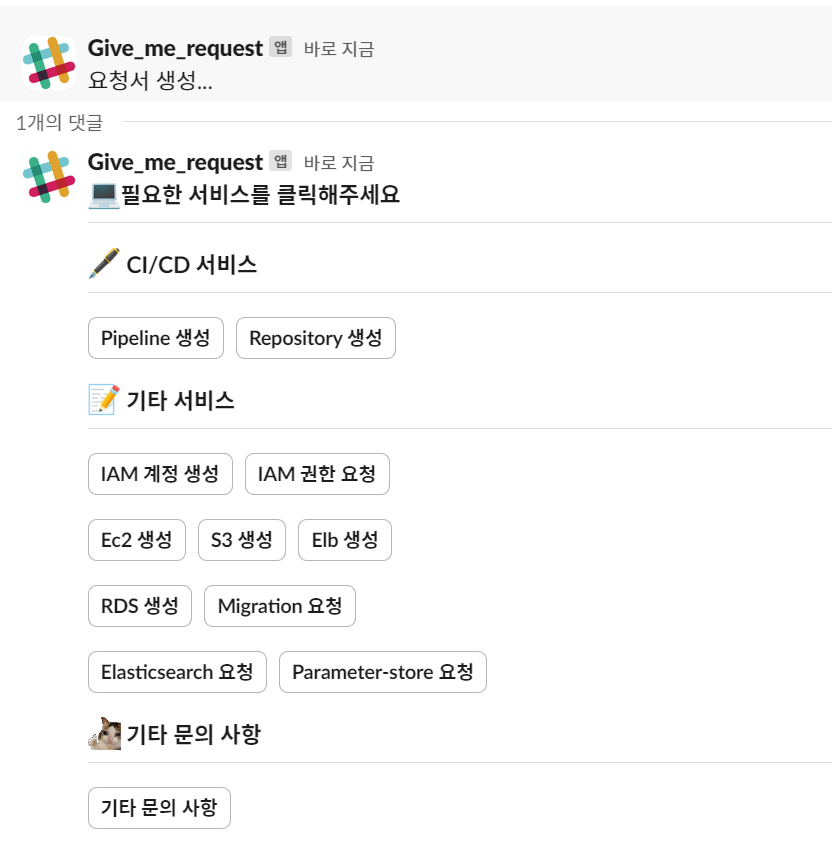
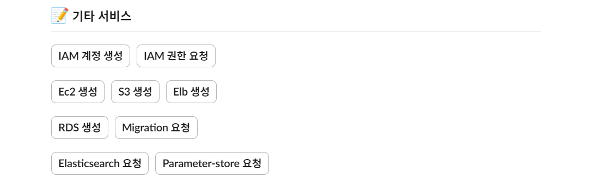
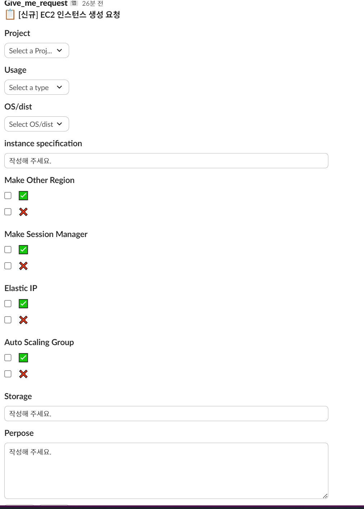
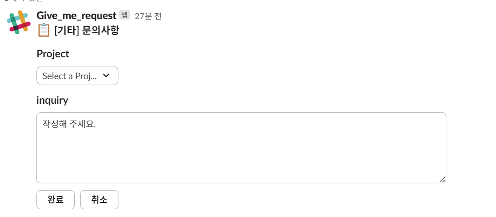
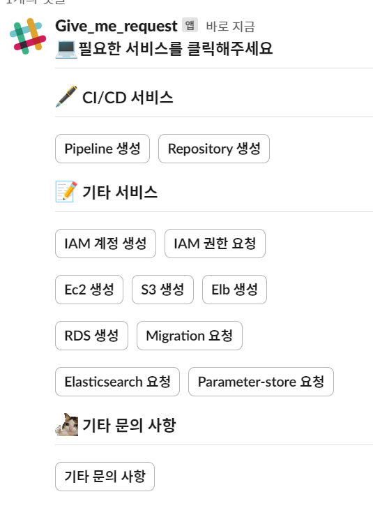

# 1. 최종 구축 형태
## 1-1. Slack bot 형태 🖥️


# 2. 특징 및 개선점
```
👉 인플레이스 업데이트 방식의 메시지 형태로 디스코드 봇처럼 간소화
```
- **`사용자 편의성 증대` : `slash-command`** 형태의 요청이 아닌 **`마우스 클릭`**만으로 요청할 수 있게 변경
- **`유지보수성, 확장성 증대` :** 아키텍쳐 리빌딩하여 기능 확장편하게 구성
- **`불필요한 핑퐁 제거` :** 모든 요청에는 요청에 대한 목적을 필수값으로 지정

# 3. 🤖 업데이트 사항
### 3-1. Gitlab과 AWS Pipeline 생성 요청 가능


- **Pipeline 생성 : 파이프라인 생성 요청**
    ```
    👉 AWS 파이프라인에서 Gitlab Repository도 지정 가능
    ```
- **파이프라인 생성 서비스 종류**
    
    - AWS Pipeline
    - Gitlab Pipeline
- **Repository 생성 : 레포지토리 생성 요청**

### 3-2. 더 많은 AWS Service 추가

- 각 버튼을 누르면 메시지가 요청서로 변경된다.
- 예시) EC2 요청서
    

### 3-3. 기타 문의 사항 추가

- 위의 구현된 서비스에 없거나 Devops에게 추가 문의 사항 있을 시 사용
    

# 4. 🏡 간단한 사용법
```
📜 **`/help-devops` 라는 slash-command를 입력하기**
```
- 위의 slash-command를 입력하면 요청서가 생성되었습니다. 라며 스레드에 버튼이 생성
    

- 서비스 버튼이 나오는데 필요한 서비스 버튼 클릭
    - CI/CD 서비스 : **`AWS(code 서비스)`**, `Gitlab`
    - 기타 서비스 : **`AWS` 서비스**
    - 기타 문의 사항 : 위의 서비스 버튼에 존재하지 않거나 Devops팀에게 추가 요청 시 사용

### 4-1. 완료 버튼
```
👉 각 서비스에서 입력값을 넣고 **`완료`** 버튼을 누르면 Devops에게 요청 내용 전달됨
```
